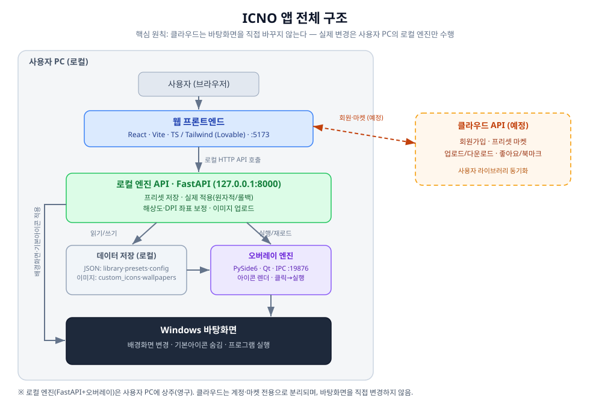
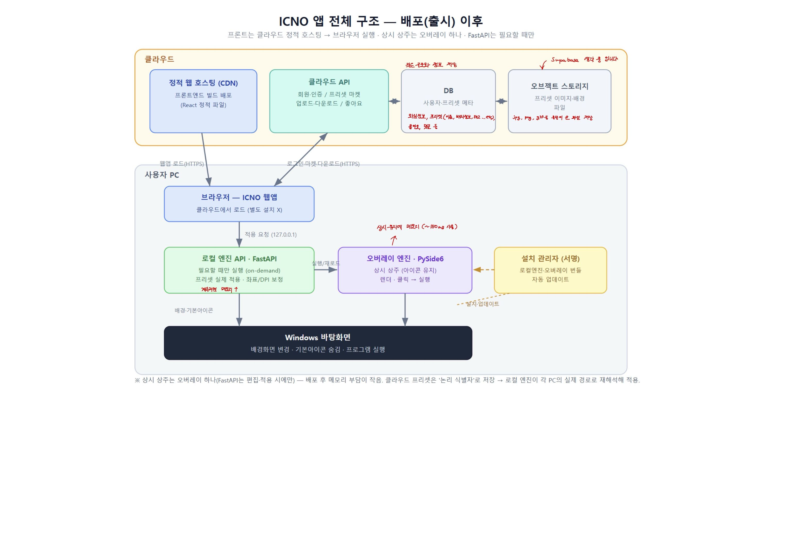

# ICNO — 프로젝트 소개

WHS4기 3반 서승린_9585

---

## 1. 목적

**실사용자 배포를 목표로 하는 Windows 데스크톱 커스터마이징 서비스**입니다.
사용자가 바탕화면의 **배경화면과 아이콘 이미지, 배치, 크기를 "프리셋" 단위**로 만들고,
이것을 **업로드, 공유, 다운로드, 적용**할 수 있습니다. (사용자가 프리셋을 올리고, 다른 사용자가 다운로드해서 자신의 바탕화면에 적용하는 형식입니다.)

현재 상태는 **로컬 환경에서 프리셋 제작 → 저장 → 실제 바탕화면 적용까지 동작하는 프로토타입을 완성**한 단계입니다. 클라우드(회원, 창작마당)와 배포 패키징은 아직 구현하지 않았습니다.

---

## 2. 기술 스택 (각 역할)

| 구분 | 스택 | 역할 |
|---|---|---|
| 웹 프론트엔드 | React + Vite + TypeScript, Tailwind, shadcn/ui (Lovable로 생성) | 프리셋 탐색, 편집, 업로드, 적용 UI를 담당하며 로컬 엔진 API를 호출합니다. |
| 로컬 엔진 API | Python + FastAPI (127.0.0.1:8000) | 이미지와 프리셋을 저장하고, **프리셋을 실제 Windows에 적용(실패 시 롤백)**하며, 해상도와 DPI 좌표를 보정합니다. |
| 오버레이 엔진 | Python + PySide6 (Qt), IPC 포트 19876 | 커스텀 아이콘을 바탕화면 위에 **오버레이로 렌더링**하고, 아이콘 클릭 시 프로그램을 실행하며, 트레이(끄기/켜기)를 제어합니다. |
| Windows 연동 | ctypes | 배경화면 변경(SystemParametersInfoW), 기본 아이콘 숨김(Win32 FindWindow/ShowWindow), 파일 선택(comdlg32), 배경 표시방식(레지스트리), DPI 인식을 담당합니다. |
| 저장소 | 로컬 JSON + 이미지 파일 | `library.json`(아이콘 보관함), `presets.json`(프리셋), `icons_config.json`(적용 상태), 이미지 폴더(custom_icons, wallpapers)로 구성됩니다. |
| (예정) 클라우드 API | 미정 (AWS, Supabase 등 검토) | 회원가입, 프리셋 마켓, 업로드/다운로드, 좋아요/북마크를 담당합니다. **로컬 엔진과는 분리됩니다.** |

---

## 3. 전체 구조

현재 프로토타입 구조도는 다음과 같습니다.



**핵심 설계 원칙:** *클라우드는 바탕화면을 직접 바꾸지 않습니다. 실제 Windows 변경은 사용자 PC의 로컬 엔진만 수행합니다.* <- 여기서 권한을 높게 쓴다고 생각이 들어서 보안 문제로 이어질 수 있다고 생각이 듭니다.

→ 그래서 백엔드가 **① 로컬 엔진(영구, PC 상주) + ② 클라우드 API(마켓, 예정)** 두 축으로 나뉩니다. 지금은 개발 환경이라서 프로그램 자체가 많이 무거운 상태입니다.

**적용 동작 흐름**
1. 웹 편집기에서 배경과 아이콘 배치로 프리셋을 구성합니다.
2. 저장하면 로컬 엔진이 `presets.json`에 저장합니다. (아이콘은 asset_id로 참조합니다.)
3. "적용하기"를 누르면 로컬 엔진이 좌표를 실제 해상도로 보정하고, `icons_config.json`에 매핑을 기록하고, 배경화면을 적용하고, 기본 아이콘을 숨기고, 오버레이를 재실행합니다. (이 전체가 원자적으로 처리되며 실패 시 롤백됩니다.)
4. 오버레이 엔진이 매핑을 읽어 커스텀 아이콘을 렌더링하고, 클릭 시 매핑된 프로그램을 실행합니다.

---

## 4. 배포(출시) 이후 구조 (계획, 변경 가능!)

현재(프로토타입)와 배포 이후는 아래처럼 바뀝니다.



**핵심 변화**
- **프론트엔드 → 클라우드 정적 호스팅(CDN)**: 개발용 Vite 서버 대신 `npm run build`로 만든 정적 파일을 CDN에 배포합니다. 사용자는 **브라우저로 접속만** 하면 되고(별도 설치가 없습니다), 실행은 사용자 브라우저에서 일어나므로 프론트엔드 때문에 로컬에 무거운 프로세스가 뜨지 않습니다.
- **클라우드 백엔드 신설 (로컬 엔진과 별개)**
  - **클라우드 API**: 회원 인증, 프리셋 마켓, 업로드/다운로드, 좋아요 등의 로직을 처리합니다.
  - **DB**: 사용자와 프리셋 메타데이터(이름, 제작자, 좋아요, 배치 좌표, 태그 등)를 저장합니다. 검색과 정렬을 위한 인덱스를 사용합니다.
  - **오브젝트 스토리지**: 프리셋의 실제 이미지 파일(배경, 아이콘)을 저장합니다. DB에는 파일의 URL만 저장합니다.
  - _(검토 중)_ 이미 프론트에 붙어 있는 **Supabase**로 DB, 인증, 스토리지, API를 한 번에 처리하는 방안을 생각 중입니다. S3, AWS를 써보고 싶긴 하지만 현실적인 문제(비용, 권한 부여 문제, 시간) 때문에 고민 중입니다.
- **로컬은 슬림화**: 상시 상주는 **오버레이 하나**(아이콘 유지)뿐이고, **FastAPI는 편집과 적용할 때만 실행(on-demand)**됩니다. 둘 다 **서명된 설치 관리자**로 번들 배포하고 자동 업데이트합니다.
- **프리셋 이식성**: 클라우드 프리셋은 절대경로(보안 문제로) 대신 **'논리 식별자'로 저장**하고, 다운로드 시 로컬 엔진이 각 PC의 실제 경로로 재해석해 적용합니다. (다른 사람의 프리셋도 내 PC에서 동작합니다.)

**배포 후 동작 흐름**
1. 사용자가 URL에 접속하면 브라우저가 CDN에서 앱을 로드합니다.
2. 로그인, 마켓 탐색, 프리셋 다운로드는 클라우드 API(및 DB, 스토리지)를 통해 처리됩니다.
3. "적용하기"를 누르면 로컬 엔진(127.0.0.1)이 실제 Windows에 적용하고 오버레이가 렌더링합니다.

**리소스**: 상시 상주는 오버레이(약 100MB대) 하나이고, FastAPI는 on-demand라 유휴 시 메모리 부담이 작습니다. (애니메이션 아이콘이 많으면 메모리보다 CPU와 배터리를 고려해야 합니다.)

---

## 5. 코드 / 실행 확인

**저장소**
- 웹 프론트엔드: `github.com/garry15907/ICNO_Frontend`
- 로컬 엔진(FastAPI + PySide6): `github.com/garry15907/ICNO_Backend`

**로컬 실행**
```bash
# 1) 로컬 엔진
cd icon_project/backend
python -m uvicorn main:app --reload --host 127.0.0.1 --port 8000
#   → http://127.0.0.1:8000/docs 에서 API 확인 가능

# 2) 웹 프론트엔드
cd desktop-aura
npm install
npm run dev -- --host localhost --port 5173
#   → http://localhost:5173
```

제 환경에서의 **실행 영상**은 따로 첨부해서 올리겠습니다!

---

## 6. 상담받고 싶은 내용 (요약)

1. **보안** — 시스템 권한(사용자 파일 접근, 아이콘↔프로그램 실행 매핑, Windows 개인화 설정 변경)을 많이 쓰는 앱이라 취약점이 걱정됩니다. 특히 향후 프리셋 공유 시 다운로드한 프리셋의 안전성이 우려됩니다.
2. **개발 방향과 구조** — 주로 AI(Claude, Codex, Lovable)의 도움으로 진행 중이라, 시니어 개발자 시각의 구조와 품질 점검이 필요하다고 생각합니다.
3. **로드맵** — 클라우드 연동, 배포와 출시 방식(코드 서명 등), 공모전/창업지원 가능성에 대해 여쭙고 싶습니다.
